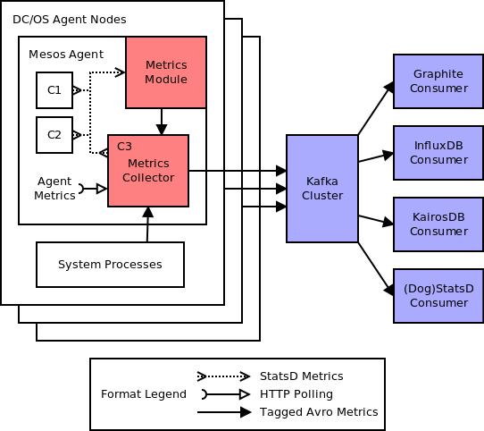

# dcos-stats

Routing of metrics from DC/OS.

## Quick Start

First, get a 1.8 EE cluster with at least 3 private nodes (minimum for default Kafka), then install the following:

1. Install [**Kafka**](http://github.com/mesosphere/kafka-private/README.md): `dcos package install kafka` or install via the Universe UI -- stock settings are fine to start with
2. Run a [**Metrics Collector**](collector/README.md#deployment-to-a-cluster) on every node: use provided marathon jsons.
3. One or more [**Metrics Consumers**](consumer/): see example marathon jsons for each consumer type, edit output settings as needed before launching

## Audiences

**I want to...**
- **emit metrics from a Mesos container**: You should check for `STATSD_UDP_HOST` and `STATSD_UDP_PORT` in your application environment, then send statsd-formatted metrics to that endpoint when it's available. You may emit your own tags using the [dogstatsd tag format](http://docs.datadoghq.com/guides/dogstatsd/#datagram-format), and they'll automatically be translated into avro-formatted tags! (see also: [example code](examples/statsd-emitter/))
- **emit metrics from a system process on the agents**: You should send avro-formatted metrics to the Collector process at `127.0.0.1:8124`. (see also: [avro schema](schema/), [example code](examples/collector-emitter/))
- **collect and process emitted metrics**: See Quick Start above. Take a look at the available [Kafka Consumers](consumer/), and see if your format already exists. If it doesn't, a new Consumer is *very* easy. (see also: [avro schema](schema/))
- **develop parts of the metrics stack**: You can run the whole stack on your local system, no Mesos Agent required! To get started, take a look at the [local stack launcher scripts](examples/local-stack).

## Repo contents

- **[module](module/)**: C++ code for the mesos-agent module. This module is installed by default on DC/OS EE 1.7+, with updated output support added as of EE 1.8+.
  - Input: Accepts data produced by Mesos containers on the agent. All Mesos containers are given a unique StatsD endpoint, advertised via `STATSD_UDP_HOST`/`STATSD_UDP_PORT` environment variables. The module then tags and forwards upstream any metrics sent to that endpoint. (EE 1.7+)
  - Output formats:
    - Avro metrics sent to a local Collector process on TCP port `8124` (EE 1.8+)
    - StatsD to `metrics.marathon.mesos` with tags added via key prefixes or datadog tags (EE 1.7 only, disabled in EE 1.8),
- **[collector](collector/)**: A Marathon process which runs on every agent node.
  - Inputs:
    - Listens on TCP port `8124` for Avro-formatted metrics from the mesos-agent module, as well as any other processes on the system.
    - Polls the local Mesos agent for additional information:
      - `/containers` is polled to retrieve per-container resource usage stats (this was briefly done in the Mesos module via the Oversubscription module interface). Similarly `/metrics/snapshot` is also polled for system-level information.
      - `/state` is polled to determine the local `agent_id` and to get a mapping of `framework_id` to `framework_name`. These are then used to populate `agent_id` on all outgoing metrics, and `framework_name` for metrics that have a `framework_id` (i.e. all metrics emitted by containers).
  - Output: Data is collated and forwarded to a Kafka instance, and/or exposed to local partner agents (TBD).
- **[consumer](consumer/)**: Kafka Consumer implementations which fetch Avro-formatted metrics and do something with them (print to `stdout`, write to a database, etc).
- **examples**: Reference implementations of programs which integrate with the metrics stack:
  - **[collector-emitter](examples/collector-emitter/)**: A reference for DC/OS system processes which emit metrics. Sends some Avro metrics data to a local Collector process.
  - **[local-stack](examples/local-stack/)**: Helper scripts for running a full metrics stack on a dev machine. Feeds stats into itself and prints them at the end. Requires a running copy of Zookeeper (reqd by Kafka).
  - **[statsd-emitter](examples/statsd-emitter/)**: A reference for mesos tasks which emit metrics. Sends some StatsD metrics to the `STATSD_UDP_HOST`/`STATSD_UDP_PORT` endpoint advertised by the mesos-agent module.
- **[schema](schema/)**: Avro schemas shared by most everybody that processes metrics (agent module, collector, collector clients, kafka consumers). The exception is containerized processes which only need know how to emit StatsD data.

## Docs

- **[Launching demo processes](DEMO.md)**
- **[Launching the Collector](collector/README.md)**
- **[Launching Consumers](consumer/README.md)**
- [Installing custom module builds (for module dev)](module/README.md)
- [Design doc: Agent module](https://docs.google.com/document/d/11XZF8600Fqfw_yY9YeSh-rX2jJVN4rjw_oQuJFkvlwM/edit#)
- [Design doc: Collector and forwarding via Kafka](https://docs.google.com/document/d/1aJifYTMrmuHnh_zpt8eLbsaU1WP_Fw3M8OvqRf0B6nE/edit#)
